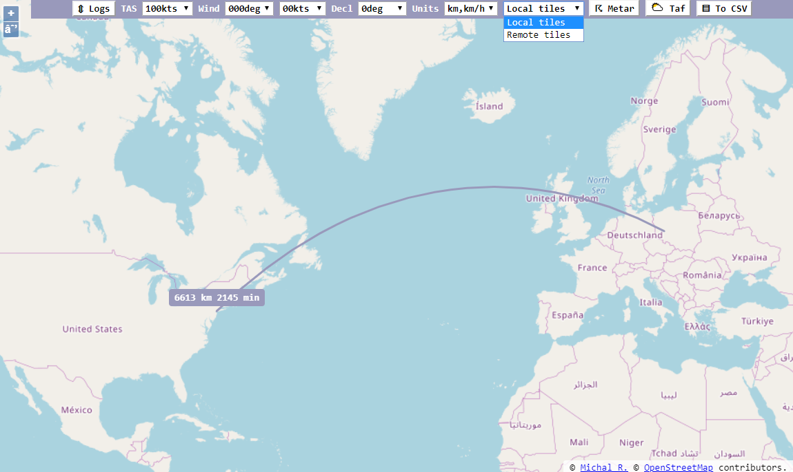
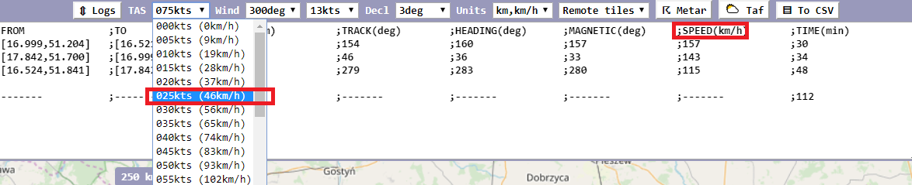
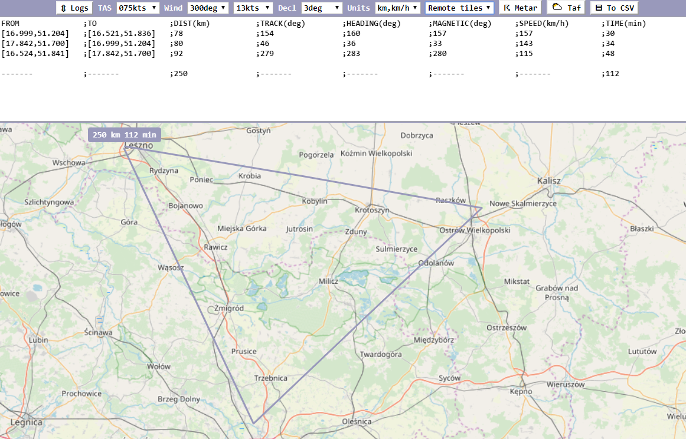
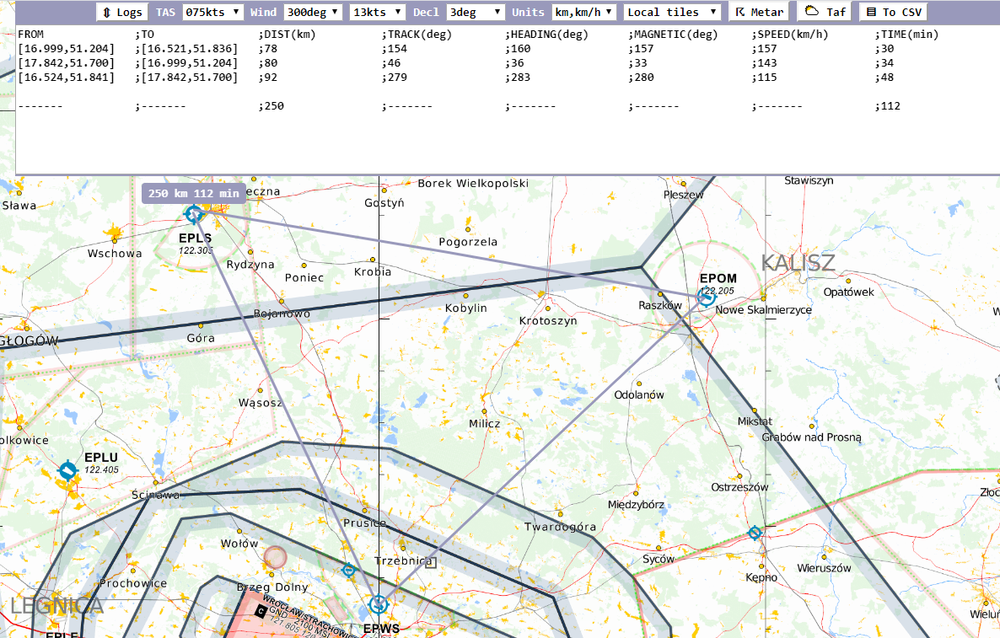

# VFR Flight Planner



## Features

* Flight planning with wind and magnetic declination correction with great circle path for longer routes
* Output in `km/h`, `km` or `nm`, `kts`, input via selection of value (both unit systems shown)\

* Background map png tiles in `EPSG:3857` format, like from https://www.openflightmaps.org/ (possibility to download ~1GB zip with tiles for given region, then paste `slippyTiles_original.zip\original\merged\256\latest` contents to local `./tiles` folder)
  * Default remote tiles from `https://{a-c}.tile.openstreetmap.org/{z}/{x}/{y}.png`, possibility to change via `?remote_tile_url=...` \

  * Default local tiles from `./tiles/{z}/{x}/{y}.png`, possibility to change via `?local_tile_url=...` \

  * Possibility to switch between `local`/`remote` background maps during planning route
  * Remote maps work out-of-the-box, while local maps require setup
* Open `METAR` and `TAF` for given route in separate page (https://aviationweather.gov/adds/), follows great circle path
* Export plan to [CSV file](https://en.wikipedia.org/wiki/Comma-separated_values) for further adjustments in external tools

## Reference

### URL search parameters
* `remote_tile_url` - remote tile source url with z,x,y coordinates embedded, like `https://site.org/{z}/{x}/{y}.png`, defaults to `https://{a-c}.tile.openstreetmap.org/{z}/{x}/{y}.png`
* `local_tile_url` - local tile source url with z,x,y coordinates embedded, like `https://site.org/{z}/{x}/{y}.png`, default for local execution - `file:///` site scheme, defaults to `./tiles/{z}/{x}/{y}.png`
* `log_units` - the result `CSV` output units, `metric` (km/h, km) or `nautical` (kt, nm)
* `z` - the initial `EPSG:3857` zoom level, defaults to `5`
* `lon` - initial map's center longitude, defaults to `16.5238`
* `lat` - initial map's center latitude, defaults to `51.8320`

### Local vs remote tiles concept
The assumption is that local tiles, by default located in `./tiles` next to the html file, can be used as alternative background map layer. User can download the offline version from https://github.com/rogalmic/flight-planner/releases , which contains some tiles up to zoom level 6, then add more zoom levels for specific location from any source. This way planning can be done in offline scenario. User can also set 2 different urls for local/remote tiles, then switch then during planning (topography vs airspace).   

### Weather info
Since this project goal is to be simple calculation helper, the wind is set manually. However once route is set, there is a way to query METARs and TAFs for given route. User needs to manually read the weather info and input wind direction and speed.

## Samples

* [OSM MAP VERSION](https://rogalmic.github.io/flight-planner/flight.html?log_units=metric)
* [OSM MAP VERSION (results in nm and kts, US centered)](https://rogalmic.github.io/flight-planner/flight.html?log_units=nautical&z=5&lon=-97.479&lat=39.408)
* [WIKIMEDIA MAP VERSION](https://rogalmic.github.io/flight-planner/flight.html?remote_tile_url=https%3A%2F%2Fmaps.wikimedia.org%2Fosm-intl%2F%7Bz%7D%2F%7Bx%7D%2F%7By%7D.png)
* [NO LABELS MAP VERSION](https://rogalmic.github.io/flight-planner/flight.html?remote_tile_url=https%3A%2F%2Ftiles.wmflabs.org%2Fosm-no-labels%2F%7Bz%7D%2F%7Bx%7D%2F%7By%7D.png)
* [OPENFLIGHTMAPS MAP VERSION](https://rogalmic.github.io/flight-planner/flight.html?remote_tile_url=https%3A%2F%2Fsnapshots.openflightmaps.org%2Flive%2F2003%2Ftiles%2Fworld%2Fepsg3857%2Faero%2F512%2Flatest%2F%7Bz%7D%2F%7Bx%7D%2F%7By%7D.png&z=7)
* [OPENTOPOMAP MAP VERSION](https://rogalmic.github.io/flight-planner/flight.html?remote_tile_url=https%3A%2F%2Ftile.opentopomap.org%2F%7Bz%7D%2F%7Bx%7D%2F%7By%7D.png)

## Objectives

* as simple as possible with interaction options at every step, nothing purely automatic
* based on OSM, but with possibility to change to different source
* remember offline data in `tiles` folder, see https://github.com/hdjarv/osm-tile-downloader, offline deliverable built in `travis`

## Requirements

* recent browser with support for `HTML5` and `ECMAScript 2015`

## Dev Requirements

* Really easy, just try :)
* `Visual Studio Code`
* `Git`
* `Debugger for Chrome` or `Debugger for Chrome` VsCode extension

 1. Get repo \

```shell
git clone "https://github.com/rogalmic/flight-planner.git"
code "./flight-planner/"
```
 2. Select debug option (chrome or firefox)
 3. Run debug session
 4. Optionally load tiles in proper folder structure to `./tiles/{z}/{x}/{y}.png` (`EPSG:3857` format)
